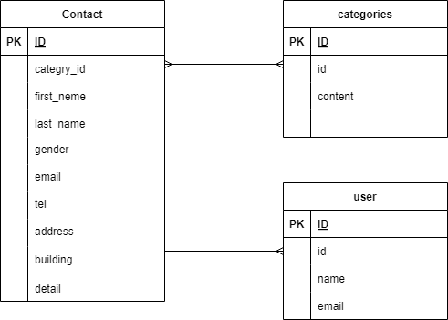

# アプリケーション名
お問い合わせフォーム

## 環境構築
・リポジトリの設定  
1. コマンドラインにてgit clone git clone git@github.com:yuusukejinba/jinba-kadai.git  

・Docker の設定  
1.docker-compose up -d --build  
2.docker-compose exec php bash:PHPコンテナ内にログイン  
3.composer install:コンポーズインストール  

・.env ファイルの作成  
1.cp .env.example .env:.env.exampleファイルをコピー  
2.DB_HOST=127.0.0.1→DB_HOST=mysql  
3.DB_DATABASE=→DB_DATABASE=laravel_db  
4.DB_USERNAME=→DB_USERNAME=laravel_user  
5.DB_PASSWORD=→laravel_passに変更  

・contactsテーブル作成済み  
・categoriesテーブル作成済み  
・userテーブル修正済み  

## 使用技術(実行環境)
Laravel Framework 8.83.8  

## ER図
  

## URL
開発環境:http://localhost/  
お問い合わせフォーム確認ページ:http://localhost/contacts/confirm  
サンクスページ:http://localhost/thanks  
ユーザ登録:http://localhost/register  
ログインページ:http://localhost/login  